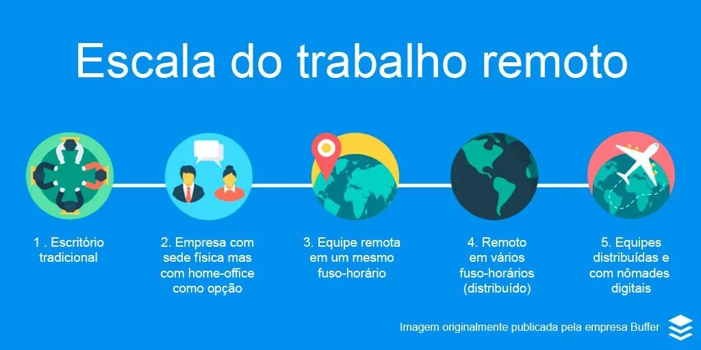

## O Que É Trabalho Remoto?

### Trabalho Remoto != Home Office

Home Office se entende que será trabalhado de casa, porém, o trabalho remoto vai muito além, pois ele possibilita novas rotinas, conexões e modifica a estrutura obrigatória de trabalho do escritório. Além disso, retira a obrigatoriedade de concentração em grandes polis, o que afeta positivamente as cidades.

### Modelos de Trabalho

A empresa Buffer definiu 5 possíveis configurações de trabalho remoto:

Imagem 1: imagem publicada pela empresa Buffer, exemplificando a escala do modelo de trabalho remoto.

- `location independent:` Não depender de um local fixo.

## Pré-requisitos para mundaça de modelo

- **mudança de comportamento:** necessidade de um comportamento proativo, que antecipar possíveis problemas no lugar de resolve-los quando eles estão visíveis. Logo, evite comportamento reativo e não deixe as coisas para fazer na última hora :smile:.
- **mudança de comunicação:** A comunicação deve ser clara para todos os membros da equipe, é importante lembrar que no trabalho remoto os membros se encontram em diferentes localidades, sendo assim, haverão variedades linguísticas o que podem afetar a comunicação, entretanto, temporalmente a equipe por osmose se compreenderá, porém, não torne todo o seu dialeto em algo da sua localidade. Aqui vai algumas das recomendações feitas pela Impulso Network:
  - Entender que a comunicação vai ser diferente em um ambiente digital;
  - Entender que faz parte da comunicação ser transparente e dar acesso a todas as informações que o seu time precisa para fazer o seu trabalho e também para saber em que você está trabalhando naquele momento;
  - Entender que se fazer presente faz parte de uma boa comunicação com seu time;
  - E que o princípio da proatividade se aplica aqui também.
- **mudança no modelo mental:** é necessário uma modificação no pensamento de trabalho. O modelo mental de trabalho presencial se diferem bastante, por isso deve-se estabelecer um pensamento Remote First.
- 
## Pensamento Remote First

O pensamento Remote First visa em estabelecer o ambiente virtual como ambirente primário para o engajamento da equipe. Sendo assim, caracterizasse como ambiete principal para comunicação, compartilhamento de ideias, e documentação, etc.

### Ambientes Híbridos

É importante que as equipes mantenham o ambiente virtual como principal, pois caso as equipes que estão trabalhando diretamento do escritório tenham o costume de comunicar entre eles isoladamente, os membros que atuam pelo trabalho remoto podem acabar sendo excluidos ou não obtendo informações importantes para do desenvolvimento do projeto. Portanto, em ambientes híbridos que se encontram dessa forma é importante comunicar os lideras e tentar minimizar tais problemas.

### Equipes

Mormente, todos os membros da equipe precisam saber as informações necessárias para executar o seu trabalho, logo pergunte-se:

- Saber o que está acontecendo em um determinado projeto?
- Saber quem está responsável pelo o que?
- Saber qual a prioridade de cada tarefa?
- E saber o que está sendo feito naquele dia por cada pessoa?

Se a resposta for não para alguma dessas perguntas marque uma reunião com sua equipe e busque melhores formas de comunicação. Aqui algumas outras formas de conseguir melhorias neste aspecto:

- Abrir a discussão online.
- Dar todo o contexto do que já foi conversado.
- E colocar todo mundo na mesma página.

Além disso, o ambiente de trabalho é um ambiente de convívio, logo é importante o equilíbrio das pessoas, então pregunte também se o seu colega de trabalho está ligado ao que ocorre no projeto. Aqui vai algumas perguntas que podem ser feitas:

- Essa pessoa sabe o que está acontecendo?
- Ela tem tudo o que ela precisa para fazer o trabalho dela?
- Ela tem acesso às informações sobre o projeto ou tarefa dela?
- Ela tem contexto suficiente para contribuir em cima das ideias?

**É importante ressaltar que sempre que puder auxilie outras pessoas, pois muitas vezes elas podem não saber como interagir. Contudo, priorize VOCÊ, e ajude apenas caso tenha certeza que não afetará no seu desenvolvimento.**

## Ferramentas

1. A escolha de ferramenta será a última coisa a ser feita pela empresa, pois ferramentas são mutáveis e a cada dia surgem novas opções no mercado.
2. A escolha de muitas ferramentas dificultam na consistência das informações, assim é importante buscar o uso do mínimo de ferramentas na resolução do maior número de problemas.
   -  `Exemplo`: uma empresa mantêm dois backlogs, no Jira e outro pelo Zenhub no github, sempre que houver mudanças do backlog deveram ser realizadas nos dois, o que demandará no dobro de trabalho e sempre haverá a possibilidade de alguém esquecer de atualizar um deles.
3. O resultado pode ser adquirido sem o uso de ferramentas, logo para se realizar algo não há a necessidade do uso de ferramentas. Contudo, o uso de tais facilitam o alcance de metas, que por consequência apoiam o trabalho remoto.

Algumas perguntas que podem ser feitas na escolha de ferramentas de trabalho:

- O que você precisa fazer?
- Você precisa realmente de uma nova ferramenta ou consegue adaptar as que já usa para o que vai fazer?
- Como essa ferramenta se encaixar em outras ferramentas e processos já existentes?
- Quem vai utilizar ou quem precisa ter acesso?
- Você sozinho? Seu time? Todos na empresa?
- Com que frequência você vai utilizar essa ferramenta?
- Ela substitui alguma ferramenta que você já usa?
- Ela é fácil de utilizar e configurar? Se não, vale a pena gastar o seu tempo configurando?
- E, por último, quanto isso vai custar no seu orçamento? O benefício de economia de tempo que ela traz compensa esse custo?

Com isso é importante dizer que ferramentas são importantes, entretanto, não são a principal prioridade para uma empresa funcionar. Sendo assim, análise o que a empresa precisa e priorize conforme a ordem a baixo:

1. Primeiro invista nas pessoas
2. Depois na Cultura
3. Depois nos Processos
4. E só depois em ferramentas que permitem tudo isso acontecer